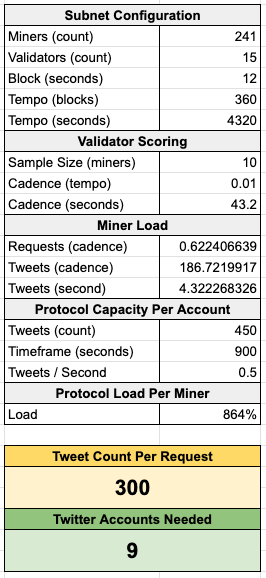
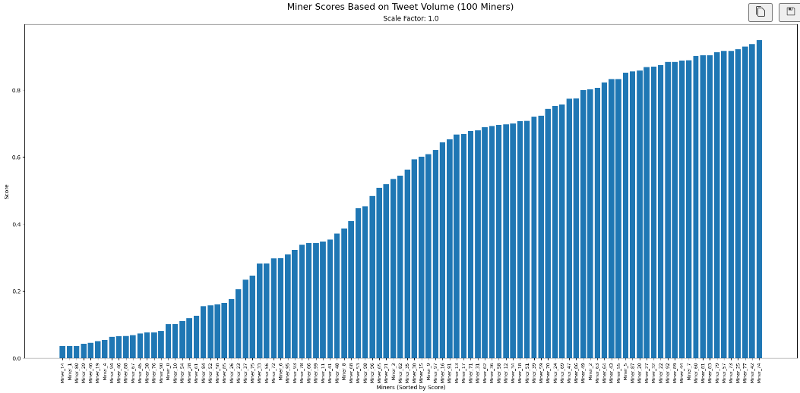

# MIP-2: Subnet Miner Competition

## Preamble

- **MIP Number**: #2
- **Title**: Subnet Miner Competition
- **Author(s)**: @grantdfoster
- **Type**: Standards Track
- **Status**: Draft
- **Created**: 29-10-2024
- **Version**: 0.1

## Summary & Motivation

We need to have a centralized, documented conversation around improving miner competition on the subnet. This MIP will both capture the current problems and propose solutions.

In the current iteration of the subnet `v1.0.2`, the validators define a "maximum amount of work" a miner can do. This is problematic for miner competition, as the ceiling is quickly reached by the majority of the miners on the metagraph. This issue is compounded by the fact that the validator selects miners at random for volume scoring. The result is that emissions per miner become more "random" than "earned", and competition is stifled.

This MIP will focus on the pieces of logic that contribute to the issue, and propose implementation(s) for their resolution.

## Rationale

It is important to remove the concept of a hard-coded cap on the work a miner can do. By defining the "maximum amount of work" a miner can do, we are also defining a plateau for competition, that is often quickly reached. Due to the randomness in how miners are selected for scoring, emissions per miner are more "random" than "earned", as all miners on the subnet do "perfect" work. The result is that miners are randomly de-registered from the metagraph, discouraging participation and competition at large. The below specifications aim to address these issues, and work in tandem to improve miner competition and fairness on the subnet.

## Specification

1.  ### Miner Defined Tweet Count

    We need to transfer the definition of a "maximum tweet count" from the validator to the miner. Validators should only supply a query and a timeout, and miners race to scrape as many tweets as possible based on that query, within a given timeframe. This will remove the concept of a "perfect score" in favor of limitless miner competition. Allowing the miners to decide how many tweets to scrape per request will let them fine-tune their infrastructure to maximize scoring and account usage.

2.  ### Dynamic, Trending Queries

    To support the idea of maximum miner competition, the validators need to supply the miner(s) with queries that have enough volume to drive competition. We propose that validators dynamically fetch trending queries from a 24-48 hour period, ensuring not only volume, but randomness and relevance as well. This strategy addresses the issue of "unfair queries", i.e. queries with low volume that are passed to miners for volume scoring. By ensuring volumous, random, and relevant queries, the competitve landscape for miners will be much more even and fair, and give increased value to the data produced by the subnet.

3.  ### Score Unique Tweets Per Miner

    We want to ensure miners are not simply responding with stored tweets for a given query and date range. Validators can record tweets per miner (by ID), and only score those that are unique. This helps ensure that miners are actively scraping fresh data, and is supported by the dynamic query implementation mentioned above.

4.  ### Reduce Randomness in Scoring

    The current selection logic for scoring miners is random, which creates an unfair landscape for miner competition and emissions. Validators should iterate through the entire miner metagraph before repeating, which will reduce randomness in miner selection, and in turn emissions. Keep in mind each validator can still "randomly iterate", but they must exhaust the list of UIDs before repeating.

5.  ### Increased Timeout

    We need to give miners enough time to scrape the maximum number of tweets possible. Given the increased volume validators will be asking miners to scrape, we should also increase the response timeout. It currently sits at "8" seconds, but should be increased to a more reasonable timeframe.

## Modeling

We can model the impact of these changes by first understanding the relationship between the validator's scoring cadence and the miner's max tweets per request, specifically how many accounts are needed to support the demand from the subnet validators. The following table illustrates the relationship between the subnets configuration and miner load:



Our [scoring mechanism](https://developers.masa.ai/docs/resources/miner-scoring) normalizes miner performance across the metagraph, and applies a kurtosis curve to ensure that both top performers are rewarded, and they don't earn disproportionately more than the rest of the metagraph. Due to this, the increase in miner volume will not result in a noticeable change in the shape of the scoring curve and emission distribution. You can view the [detailed graph and analysis](../assets/mip-2-volume-scoring.ipynb).



## Backwards Compatibility

We will need to preserve the `count` and `keywords` property defined in `config/twitter.json` until every validator has updated to the new software release that implements this MIP.

## Test Cases

We can test this implementation on our testnet by running a few validators alongside a handful of miners, all behaving independently. The miners will compete to scrape as many tweets as possible, simulating the mainnet environment, and we can analyze the resulting emissions from the metagraph. The emissions distribution should remain similar to before, only with increased fairness.

- Tweet count is controlled by each miner
- Miner list is exhausted before repeating
- Only unique tweets per miner (uid) are scored
- Keywords are dynamic and trending
- Scoring timeout is increased to 40 seconds

## Implementation

1. ### Remove Tweet Count Limit

   Remove the concept of a pre-defined tweet count, specifically in [the volume scoring logic](https://github.com/masa-finance/masa-bittensor/blob/main/masa/validator/forwarder.py#L159). Make "count" and optional parameter in the `RecentTweetsSynapse` request. This way, organic requests are still supported through the validator API, but synthetic volume scoring has no pre-defined limit.

   ```python
   request = RecentTweetsSynapse(query=query)
   ```

2. ### Dynamic, Trending Queries

   Derive a dynamic method for fetching trending queries. The validator will need to supply the miner(s) with queries that have enough volume to drive competition. The validator currently fetches `keywords` from `config/twitter.json` in the repository. We need to update [this function](https://github.com/masa-finance/masa-bittensor/blob/main/masa/validator/forwarder.py#L131-L147) to fetch a dynamic list of queries.

   ```python
    async def fetch_twitter_queries(self):
        try:
            trending_queries = TrendingQueries().fetch()
            self.validator.keywords = [
                query["query"] for query in trending_queries[:10]  # top 10 trends
            ]
            bt.logging.info(f"Trending queries: {self.validator.keywords}")
        except Exception as e:
            # handle failed fetch - default to popular keywords
            bt.logging.error(f"Error fetching trending queries: {e}")
            self.validator.keywords = ["crypto", "btc", "eth"]
   ```

3. ### Unique Tweets Per Miner

   Store all valid tweet IDs each miner responds with, only counting unique tweets by miner. We must add a piece of state in the validator state to record UID and list of tweet ids that said UID has scraped. Code must be updated in [this function](https://github.com/masa-finance/masa-bittensor/blob/main/masa/validator/forwarder.py#L149-L297) to support this. Validator state can be updated [here](https://github.com/masa-finance/masa-bittensor/blob/main/masa/base/validator.py#L442-L482). When we resync the metagraph, the validator can wipe the volumes, scores, and tweets by any UID that was de-registered.

   ```python
   # Initialize the state
   self.tweets_by_uid = {}

   def add_tweet_id(hotkey: str, tweet_id: int):
   if hotkey not in self.tweets_by_uid:
       self.tweets_by_uid[hotkey] = set()
       self.tweets_by_uid[hotkey].add(tweet_id)

   # Example usage
   add_tweet_id('3', 17098359098246020)

   # Convert sets to lists for final representation
   tweets_by_uids = {k: list(v) for k, v in self.tweets_by_uid.items()}
   print(tweets_by_uids)

   # Output: {'3': [17098359098246020, 17098359098246024]}
   ```

4. ### Reduce Randomness in Miner Selection and Querying

   We need to update [this function](https://github.com/masa-finance/masa-bittensor/blob/main/masa/utils/uids.py#L49) to take an additional argument - the miner uids that have already been called in any given "round". Once there are no more UIDs to call, we reset the "round" for that particular validator. We can specficially compare the available UIDs [here](https://github.com/masa-finance/masa-bittensor/blob/main/masa/utils/uids.py#L80-L82) with a stored list of UIDs. No real need to persist this array in the validator state, it can start fresh on a fresh run.

   ```python
   if not hasattr(self, 'called_uids'):
       self.called_uids = set()

   uids = torch.tensor(version_checked_uids)
   available_uids = [uid for uid in version_checked_uids if uid not in self.called_uids]

   if len(available_uids) == 0:
       self.called_uids = set()
       available_uids = version_checked_uids

   self.called_uids.update(available_uids)

   uids = torch.tensor(available_uids)
   return uids
   ```

5. ### Increase Timeout

   Increase timeout from "8" seconds to "40" seconds, which is more reflective of the increased volume of tweets to be scraped. Can pass a `timeout` argument on [this line](https://github.com/masa-finance/masa-bittensor/blob/main/masa/validator/forwarder.py#L161-L163), and additionally into the protocol request so miners can see when their nodes are timing out.

   ```python
   responses, miner_uids = await self.forward_request(
       request, sample_size=self.validator.config.neuron.sample_size_volume, timeout=40
   )
   ```

6. ### Max Tweets Per Request Configuration

   Add a configuration to the miner to define the maximum number of tweets it will scrape per request. This will allow miners to fine-tune their infrastructure to maximize scoring and account usage. Miners may use the above calculator to determine how many accounts they need to support the desired tweet count per request.

   ```python
   parser.add_argument(
       "--twitter.max_tweets_per_request",
       type=int,
       help="Defines the max number of tweets to scrape per request.",
       default=200,
   )
   ```

   This value is then passed into the `RecentTweetsSynapse` request from the miner side, and used to limit the number of tweets scraped.

   ```python
   class TwitterTweetsRequest(MasaProtocolRequest):
       def __init__(self, max_tweets: int):
           super().__init__()
           # note, the count is determined by the miner config --twitter.max_tweets_per_request
           self.max_tweets = max_tweets

       def get_recent_tweets(
           self, synapse: RecentTweetsSynapse
       ) -> Optional[List[ProtocolTwitterTweetResponse]]:
           bt.logging.info(
               f"Getting {synapse.count or self.max_tweets} recent tweets for: {synapse.query}"
           )
           response = self.post(
               "/data/twitter/tweets/recent",
               body={"query": synapse.query, "count": synapse.count or self.max_tweets},
               timeout=synapse.timeout,
           )
           if response.ok:
               data = self.format(response)
               bt.logging.success(f"Sending {len(data)} tweets to validator...")
               return data
           else:
               bt.logging.error(
                   f"Twitter recent tweets request failed with status code: {response.status_code}"
               )
               return None

   ```

## Copyright

This work is licensed under the Apache-2.0 License.
